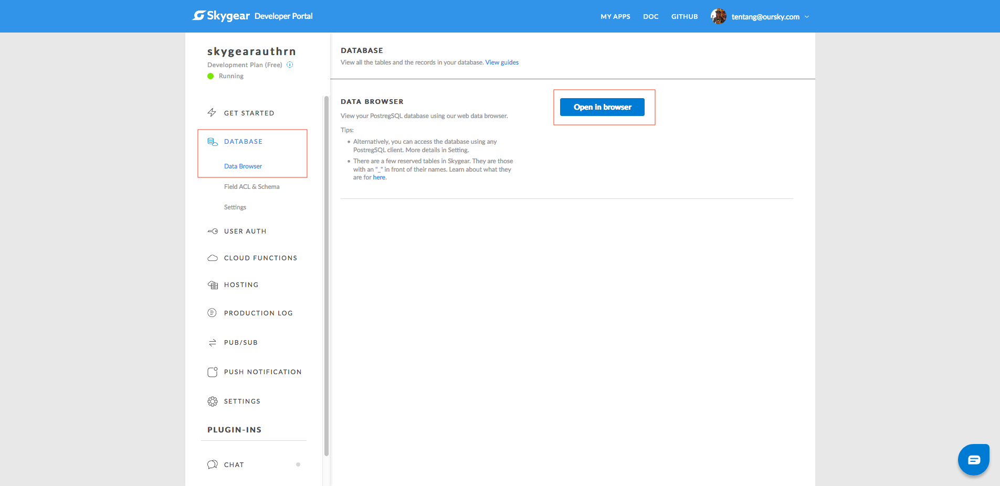
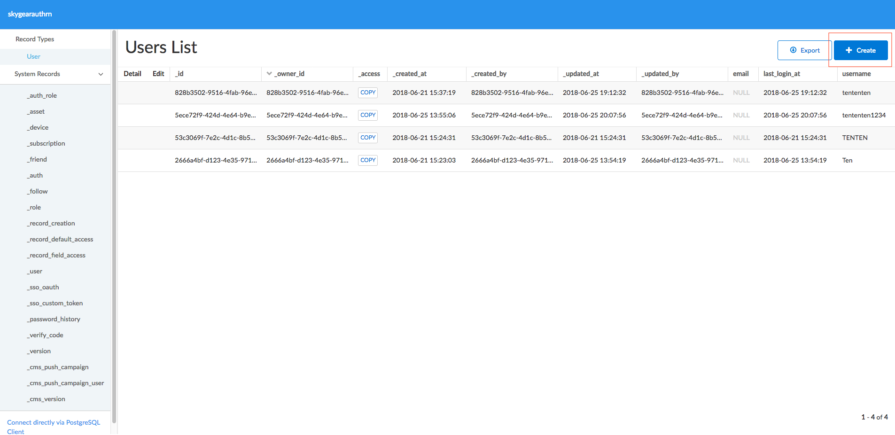
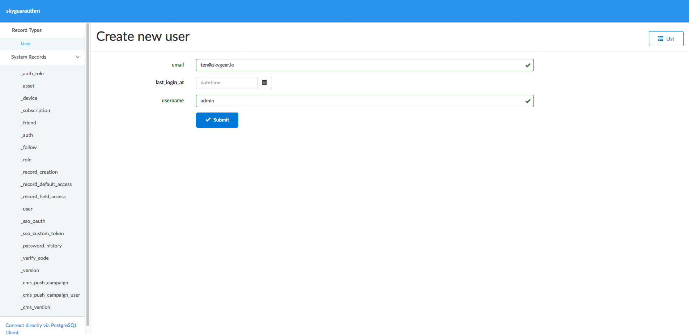
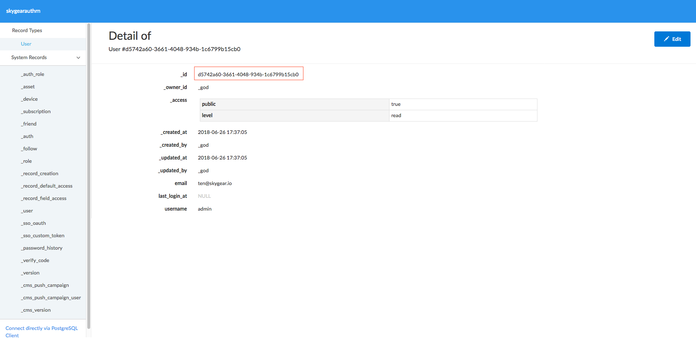

# skygear-cloud-py-stripe

This demo demostrates the use of Python Skygear Cloud Functions to make payment requests to Stripe.

Skygear is a serverless platform that provides cloud functions hosting for Python and JavaScript routines. 

Checkout the tutorial of this demo here: (Coming soon)

## Run this project

### Setting up

1. Clone this project to your machine.

      ```
      git clone git@github.com:skygear-demo/skygear-cloud-py-stripe.git
      ```

2. Get a Skygear account at https://skygear.io/signup. Then update `skygearEndpoint` and `skygearApiKey` in `public_html/index.js` with the endpoint and api key you get from the Developer Portal after signing up.

      ```
      const skygearEndpoint = '<your-skygear-app-endpoint>'
      const skygearApiKey= '<your-skygear-app-api-key>'
      ```

3. Go to the database broswer at the Developer Portal. Create a user and copy his id. Update the container configuration with the user id you copy in `__init__.py`.

      ```
      def getSkygearContainer():
          container = SkygearContainer(
              api_key=options.masterkey,
              user_id='<your-user-id>'
          )
          return container
      ```






3. Get a Stripe account at https://dashboard.stripe.com/register. Then update `stripePublishableKey` in `public_html/index.js` and `stripe.api_key` in `__init__.py` when the publishable key and secret key you get from the Stripe dashboard (Developers > API keys)

      `public_html/index.js`
      ```
      const stripePublicKey = '<your-stripe-publishable-key>'
      ```

      `__init__.py`
      ```
      stripe.api_key = '<your-stripe-secret-key>'
      ```

### Deploy 

You can use skycli to deploy cloud functions on to the Skygear cloud.

1. Install skycli

      ```
      npm install skycli -g
      ```

2. Sign in to skycli
      ```
      skycli login
      ```

3. Replace `<your-app-name>` in `skygear.json` with your Skygear app name.
      ```
      {
        "version": 1,
        "app": "<your-app-name>"
      }
      ```

4. In the project directory, run `skycli deploy`. If you see 'Build completed successfully', it means our cloud functions have been deployed to the Skygear cloud.
      ```
      skycli deploy
      ```

5. Go to `https://<your-app-name>.skygeario.com/static/index.html` to test the application. Enjoy!

# Support
For bug report, please create an issue. For support and questions, please reach us at the [Skygear community](https://discuss.skygear.io).
